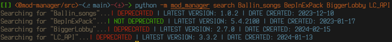

# mod-manager

[](https://pypi.org/project/mod-manager)
[](https://pypi.org/project/mod-manager)

-----

## Table of Contents

- [Installation](#installation)
- [License](#license)
- []

## Installation

```console
pip install mod-manager
```

## License

`mod-manager` is distributed under the terms of the [MIT](https://spdx.org/licenses/MIT.html) license.

## About

mod-manager is a command line utility meant to help in downloading, searching, and version controlling mods from [thunderstore.io](https://thunderstore.io)

mod-manager works by using click context in order to pass around flags and values to the underlying commands. For this reason, most of the options that are necessary will need to be given to the main `tmm` command

It has 3 main utilities that get installed as a python binary under `tmm`
1. `tmm download`
    * `tmm download` takes no arguments in and of itself, but uses all the flags of the main top command. Heres an example command for downloading 'BepInExPack'
    ```bash
    > tmm -p BepInExPack download
    ```
2. `tmm redownload`
    * `tmm redownload` takes one argument, the json file which was output by the `tmm download`. `tmm download` creates a 'versions.json' that has all the settings and values from when the package\_index was downloaded
    ```bash
    > tmm redownload /path/to/versions.json
    ```
3. `tmm search`
    * `tmm search` takes any amount of arguments for searching using the package\_index that thunderstore provides. To show the actual output from the commands, you can use the `--no-suppress` flag to see what the script would grab for that specific variable, and `--only-latest` to only see the latest if you do choose to not suppress the output
    * The output looks like this
    
